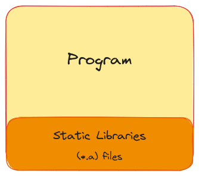

About
---
<!-- pause -->
# About me


- I'm Tanishq.
<!-- pause -->
- A fullstack developer. And,
<!-- pause -->
- A JS lover

<!-- end_slide -->
About
---
# About me


- I'm Tanishq.
- A fullstack developer. And,
- A JS lover (Or am I).

<!-- end_slide -->

Bun FFI
---
<!-- pause -->
# What is FFI?
<!--pause-->
- FFI stands for Foreign Function Interface.
<!--pause-->
-
## What does it do?
- It let's us call functions from shared libraries via C API.
<!--pause-->
- Ok, and?
-
<!--pause-->
-
### Here's a cool looking diagram

<!--pause-->
Cool! But what's a shared library?

<!-- end_slide -->
Shared vs Static Libraries
---
<!--pause-->
Before learning shared libraries, first let's understand what are _static libraries_.
<!--pause-->

## Static Libraries
<!--pause-->
- Static libraries are code that is loaded into the program during compile time.
<!-- pause -->
- Static libraries are also known as "archives".
-
    - Why? Because they are created using archiving application (e.g - "ar").

<!-- pause -->
-
-


<!-- end_slide -->

Static library
---
<!-- pause -->
# Static Libraries
Let's go through a quick overview of how static libraries are made.

<!-- pause -->
## Creating a static library
<!-- pause -->
Let's make a static library.
<!-- pause -->
**Example code**
```c
// file: sum.c
int sum(int a, int b) {
    return a + b;
}
```
<!-- pause -->

**Compiling our code**
```bash
gcc -c sum.c # creates a sum.o file
```

<!-- end_slide -->
Static library
---
**Archiving our object file**
```bash
ar -rc libmylib.a sum.c # archives our object file into libmylib.a
```
<!-- pause -->
# Using our library
**Example Code**
```c
// file: main.c
int main() {
    int a = 6;
    int b = 9;
    int result = sum(a,b);
}
```
<!-- pause -->
## Compiling our program with our static library
```bash
gcc main.c -L. -lmylib -o main
```

<!-- end_slide -->
Shared library
---
<!-- pause -->
# Back to shared libraries
<!-- pause -->
- Unlike static libraries, shared libraries are **dynamically linked**.
<!-- pause -->
-
## Dynamic Loading
<!-- pause -->
- When the library is dynamically loaded, the bindings are generated during the runtime.
<!-- pause -->
-
    - In other words, the caller program loads the library into memory during the runtime.

<!-- pause -->
-

<!-- end_slide -->

Shared library
---

# Advantages of this approach
- Lower memory footprint.
    - Only one copy of the shared library is kept.
- Is only loaded once in the program.
- Faster compile times.
    - Since programs are already be compiled, and library is loaded in the runtime.

<!-- end_slide -->
Bun.js
---

# Where does Bun comes into the picture.

<!-- pause -->

- Bun.js or its counterparts like node or deno does not have a compiled target.
    - Hence shared libraries are very convinient to use in them.

<!-- pause -->
