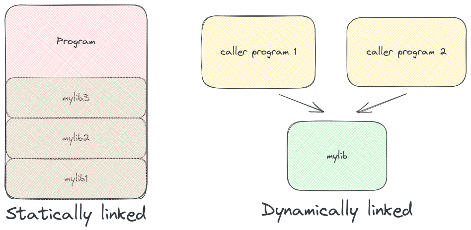

About
===
# About me

<!-- new_lines: 4 -->
<!-- column_layout: [1,1] -->

<!-- column: 0 -->


<!-- column: 1 -->

- I'm Tanishq.
<!-- pause -->
- A fullstack developer. And,
<!-- pause -->
- A JS lover

<!-- reset_layout -->
<!-- end_slide -->
About
===
# About me

<!-- new_lines: 4 -->
<!-- column_layout: [1,1] -->


<!-- column: 0 -->


<!-- column: 1 -->
- I'm Tanishq.
- A fullstack developer. And,
- A JS lover (Or am I).

<!-- reset_layout -->
<!-- end_slide -->

FFI, what?
===
<!-- column_layout: [1,1] -->

<!-- column: 1 -->
<!-- new_lines: 4 -->


<!-- column: 0 -->
<!-- new_lines: 4 -->
# What the hell is FFI?
<!-- pause -->
- FFI stands for Foreign Function interface

<!-- pause -->
## What does it do?
- It lets you open shared libraries in javascript code. Allowing you to call functions in shared libraries in JS.

<!-- end_slide -->

Shared libraries
=== 

# About Shared Libraries
<!-- pause -->
- Shared libraries are executables/binaries that can be dynamically loaded into program memory.
<!-- pause -->
<!-- new_lines: 2 -->
## Dynamic Loading 
<!-- column_layout: [1,1] -->

<!-- column: 1 -->


<!-- column: 0 -->
- When the library is dynamically loaded, the bindings are generated during the runtime.
-
    - In other words your shared library is loaded into the program memory.  

<!-- end_slide -->

Creating a Shared Library
===

# Let's see this in action

```cpp
// sum.cpp
extern "C" {
    int sum(int a, int b) {
        return a + b;
    }
}
```
**Note** - C++ needs `extern "C"` to prevent name mangling.

This program will be compiled using these flags:
<!-- new_line -->
```sh
g++ -shared -fpic -o libsum.so sum.cpp
```
<!-- end_slide -->

Powers of shared libraries
===
# Advantages of shared libraries

<!-- pause -->
- **Lower memory footprint** since shared libraries are not compiled in the program.
<!-- new_line -->
<!-- pause -->
- **Dynamically loaded**, allowing other programs to access the library without having to compile it in the executable. Hence the name "shared libraries"

<!-- new_line -->
<!-- pause -->
- In JS, allowing us to use features of other programing language. 

<!-- end_slide -->

Caveats
===
<!-- pause -->
# Some caveats with the approach
There are some caveats associated with the approach

<!-- pause -->
## Data types
<!-- pause -->
- Custom data types or JS objects can't be passed.
<!-- new_line -->
<!-- pause -->
- Shared libraries are harder to debug if not used with proper observability measures.

<!-- new_line -->
<!-- pause -->
- Memory lifetime can be unreliable if the language is garbage collected.

<!-- end_slide -->

Thank You
===
<!-- new_lines: 4 -->


# You can connect me on

## Peerlist - https://peerlist.io/tanishqsingla
### Website - https://tanishqsingla.in

